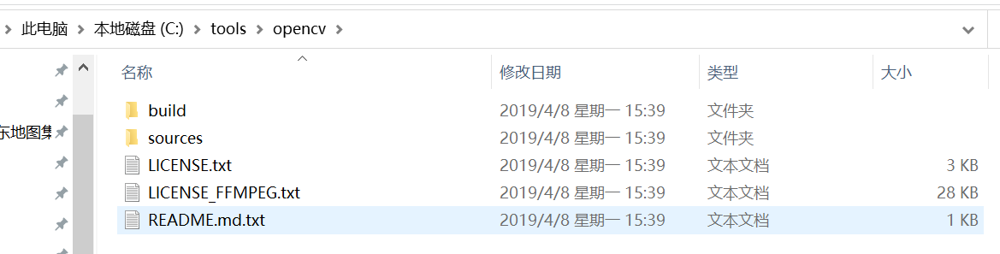
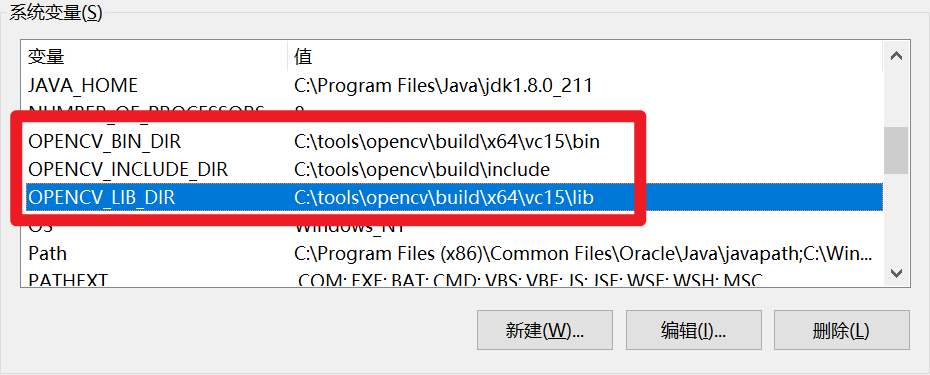
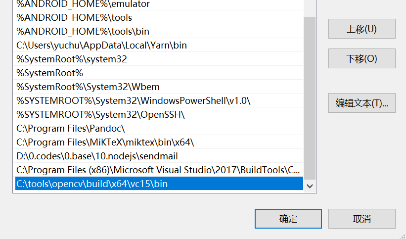

<!--
 * @Author: zyc
 * @Description: file content
 * @Date: 2021-04-21 10:38:54
 * @LastEditTime: 2021-05-08 14:21:00
-->
## 武汉大学场馆预定小脚本

**UPDATE(2022.3.27)：学校预约系统转移到智慧珞珈的小程序了，本脚本失效啦，自谋生路吧，我也经常抢不到😩**

### 简介

### 技术栈
nodejs + puppeteer

> 请按需预定，禁止商用。

## opencv4nodejs windows 安装指南

### 前言

该库依赖于 opencv 程序，所以安装难点在于 opencv 的安装。

官方指南中提了两种安装方式，一种是直接 `npm i -S opencv4nodejs` ，由 node-gyp 来构建 opencv 处理程序。

另一种是自行安装 opencv 处理程序，然后在安装 opencv4nodejs 库时，通过设置环境变量，禁用 node-gyp 自带的构建。

在实际安装中，使用第一种方式总会存在各种错误，装了好久也没装成功，最后选择使用第二种方式进行，以下介绍也重在说明第二种方式的实践。

### 1. 安装 opencv

对于 opencv 的安装， windows 中也有两种方式，一种是使用 choco 命令，另一种是在[官网](https://opencv.org/releases/)下载安装包。

第一种需要先在电脑中安装 chocolatey 包管理工具，然后重启命令行窗口，输入以下命令：

```bat
choco install OpenCV -y -version 4.1.0
```

第二种直接下载得到的 exe ，像常规软件安装即可。

### 2. 设置环境变量

安装后，应当得到如下的文件目录：



需要设置如下几个环境变量：

- OPENCV_INCLUDE_DIR ：指向 include 文件夹
- OPENCV_LIB_DIR ：指向 lib 文件夹
- OPENCV_BIN_DIR ：指向 bin 文件夹
- Path 中追加 OPENCV_BIN_DIR




> 除了上述直接设置环境变量的方式，也可以在 package.json 配置文件中体现(**没有实测过**)：

```js
// package.json
{
  "name": "my-project",
  "version": "0.0.0",
  "dependencies": {
    "opencv4nodejs": "^X.X.X"
  },
  "opencv4nodejs": {
    "disableAutoBuild": 1,
    "opencvIncludeDir": "C:\\tools\\opencv\\build\\include",
    "opencvLibDir": "C:\\tools\\opencv\\build\\x64\\vc14\\lib",
    "opencvBinDir": "C:\\tools\\opencv\\build\\x64\\vc14\\bin"
  }
}
```
### 3. 安装 opencv4nodejs

```bat
# 如果在 package.json 中设置过，就不需要再加这个
set OPENCV4NODEJS_DISABLE_AUTOBUILD=1
npm install --save opencv4nodejs
```

在安装过程中，一直卡在 canvas 的进度中，最后选择先手动安装 canvas ，然后再装 opencv4nodejs 可破。
